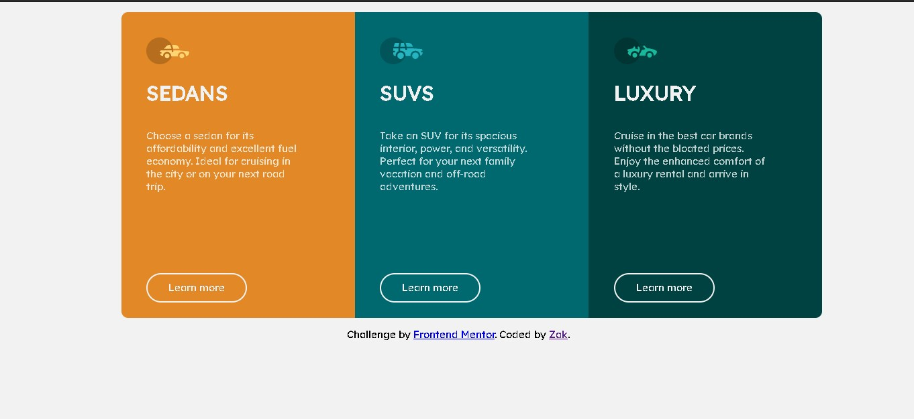

# Frontend Mentor - 3-column preview card component solution

This is a solution to the [3-column preview card component challenge on Frontend Mentor](https://www.frontendmentor.io/challenges/3column-preview-card-component-pH92eAR2-). Frontend Mentor challenges help you improve your coding skills by building realistic projects. 


## Overview

### The challenge

Users should be able to:

- View the optimal layout depending on their device's screen size
- See hover states for interactive elements

### Screenshot



### Links

- [Solution URL](https://ronaque.github.io/Zak/Projects/3-column-preview-card-component-main/)

## My process

### Built with

- Semantic HTML5 
- CSS custom properties
- Flexbox

### What I learned

i'm learning some flexbox, and could use in this project

```css:
.lista{
    display: flex;
    align-items: center;
    list-style: none;
    justify-content: center;
}
```


## Author

- Website [Zak](https://ronaque.github.io/Zak/)
- Frontend Mentor - [ronaque](https://www.frontendmentor.io/profile/ronaque)
