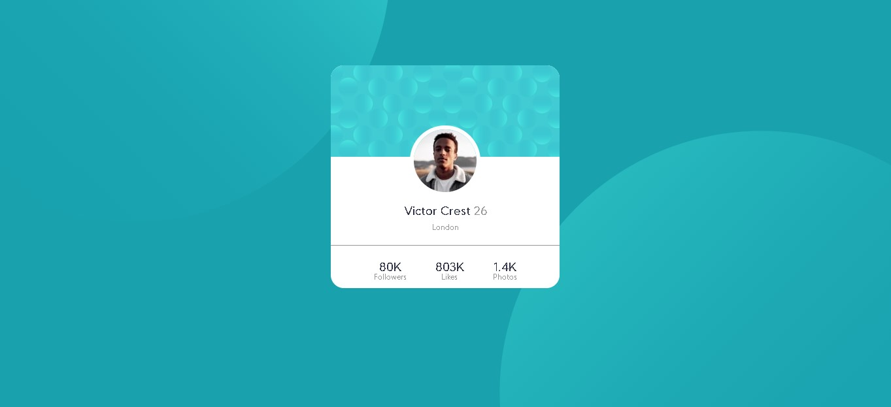

# Frontend Mentor - Profile card component solution

This is a solution to the [Profile card component challenge on Frontend Mentor](https://www.frontendmentor.io/challenges/profile-card-component-cfArpWshJ). Frontend Mentor challenges help you improve your coding skills by building realistic projects. 

## Overview

### The challenge

- Build out the project to the designs provided

### Screenshot



### Links

<!-- - Solution URL: [Add solution URL here](https://your-solution-url.com) -->
- [Live Site URL](https://ronaque.github.io/Zak/Projects/profile-card-component-main/index.html)

## My process

### Built with

- Semantic HTML5 markup
- CSS custom properties

As just a begginer.

### What I learned

```css
body{
    /*Defini a fonte e tamanho dela*/
    font-family: 'Kumbh Sans', sans-serif;
    font-weight: 400, 700;
    background-color: hsl(185, 75%, 39%);
    /*Imagens no bacground, tamanho delas, posição, se ela repete ou não*/
    background-image: url(images/bg-pattern-top.svg), url(images/bg-pattern-bottom.svg);
    background-size: 800px, 800px;
    background-position: left -200px bottom 200px, right -200px top 200px;
    background-repeat: no-repeat, no-repeat;   
}
```

I'm still not sure about this solution for the both bubbles as background, but i think it's a good learning for other occasion and i'm pretty happy with the result.


### Continued development

With this project i discovered the existence of the sass, and gonna take a look at it.


## Author

- Website - [Isaque](https://ronaque.github.io/Zak/)
- Frontend Mentor - [@ronaque](https://www.frontendmentor.io/profile/ronaque)
